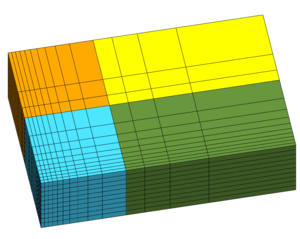

# Gridder

[Read the manual at lanl.github.io/gridder](https://lanl.github.io/gridder/).

GRIDDER is a simple interactive grid generation tool for creating orthogonal, 2D quadralateral or 3D hexahedral grids. Grid spacing can be even, logarithmic, or geometric. Gridder creates orthogonal one-dimensional, two-dimensional, or three- dimensional grids. Each dimension can have multiple regions, each with different nodal spacing. This spacing can be equal spacing, geometric spacing, or logarithmic spacing. The resulting grid can be written as AVS (Advanced Visualization Systems), Tracer 3D, Vector, or FEHM grid format. 

## Installation

Download the repo by running:

    git clone https://github.com/lanl/gridder.git

Then `cd src/` and compile for your machine:

    gcc gridder.c -o gridder
    
Run gridder interactively on the command line or with an input file.
Two files are written, the resulting grid in chosen format and a 
recording of the user choices so gridder can be rerun again.
The file *grid.type* is the grid file, *input.grid* are the recorded gridder input lines.

## Copyright and License

Los Alamos National Security, LLC (LANS) owns the copyright to GRIDDER, which it identifies internally as LA-CC-15-082. The license is BSD with a "modifications must be indicated" clause. See LICENSE for the full text.

